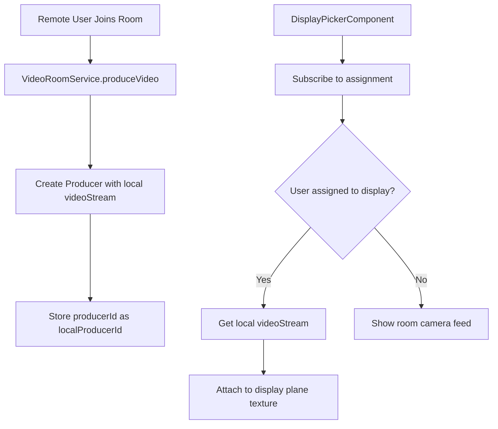

# Plan: Fix Remote User Video on Display Plane

## Problem Statement

When a remote user selects a display in the 3D room view (DisplayPickerComponent), their own video does not appear on that display plane. The current implementation only shows the room device's camera feed on display planes, not the remote user's video.

## Root Cause Analysis

The current [`attachCameraStreamToPlane()`](client-app/src/app/components/display-picker/display-picker.component.ts:272) method only looks for the **room device's camera producer** (via consumers):

```typescript
// Current code - only shows room camera, not remote's own video
for (const consumer of consumers) {
  if (consumer.producerId === slot.cameraProducerId) {
    // Shows room device's camera
  }
}
```

The remote user's own video (`videoStream`) is never attached to the display plane - it's only shown in the main video room view.

## Solution Overview

The remote user's own video should appear on the display plane they chose. This requires:

1. **Track the local producer ID** - Store the producer ID when the remote user produces their video
2. **Expose local stream to DisplayPicker** - Make the local video stream accessible
3. **Attach local video to chosen display** - Show the remote's own video on the selected display plane

## Implementation Steps

### Step 1: Store Local Producer ID in VideoRoomService

**File:** `client-app/src/app/services/video-room.service.ts`

- Add a property to track the local producer ID: `localProducerId: string | null = null`
- Update [`produceVideo()`](client-app/src/app/services/video-room.service.ts:542) to store the producer ID after creation

### Step 2: Expose Local Stream and Producer ID to DisplayPicker

**File:** `client-app/src/app/services/video-room.service.ts`

- Add public getter methods:
  - `getLocalVideoStream()` - returns `videoStream`
  - `getLocalProducerId()` - returns `localProducerId`

### Step 3: Modify DisplayPicker to Show Local Video on Selected Display

**File:** `client-app/src/app/components/display-picker/display-picker.component.ts`

- Add subscription to track the user's assignment (which display they chose)
- Modify [`updateDisplayPlanes()`](client-app/src/app/components/display-picker/display-picker.component.ts:214) to:
  - Identify which display the current user is assigned to
  - Attach the local video stream to that specific display plane instead of the room camera

### Step 4: Handle Dynamic Updates

- Subscribe to assignment changes to update the display when the user selects a new display
- Ensure the video updates when the user changes their display choice

## Architecture Diagram



## Files to Modify

| File | Changes |
|------|---------|
| `client-app/src/app/services/video-room.service.ts` | Add `localProducerId` property, update `produceVideo()`, add getter methods |
| `client-app/src/app/components/display-picker/display-picker.component.ts` | Subscribe to assignment, attach local video to chosen display |

## Testing Checklist

- [ ] Remote user joins room and sees 3D room with display planes
- [ ] Remote user selects a display
- [ ] Remote user's own video appears on the selected display plane
- [ ] Remote user can change display selection and video updates accordingly
- [ ] Other display planes still show room camera feeds