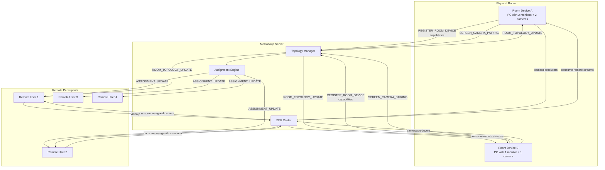
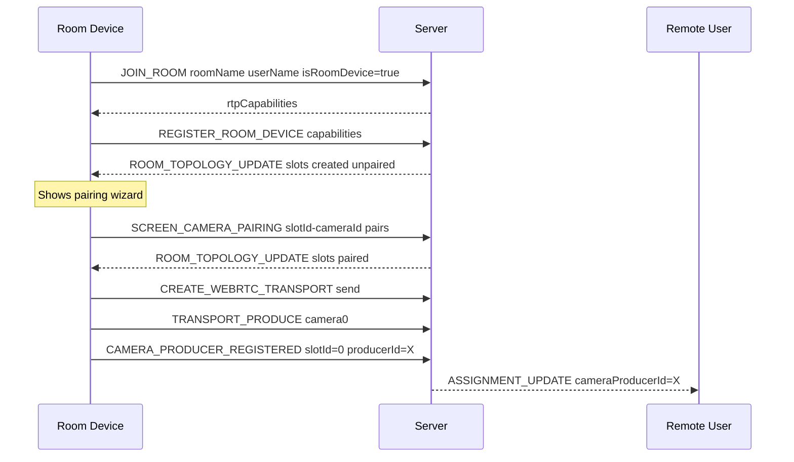
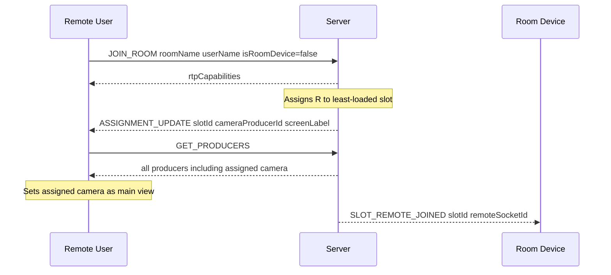

# Hybrid Video Communication Architecture Plan

## Overview

Transform the existing Mediasoup SFU video conference into a **hybrid communication system** where a physical conference room with 1-N devices (each with monitors and cameras) connects intelligently with remote participants. The system is device-count-agnostic: it works whether the room has one laptop with 3 monitors or 3 separate PCs each with 1 monitor.

---

## Core Concept

```
Physical Room                          Server                        Remote Participants
─────────────────────────────────────────────────────────────────────────────────────────
[PC-A]                                                               [Remote User 1]
  ├─ Monitor 0 ──── Camera 0 ──────►  RoomTopology                    └─ main view = Camera 0
  └─ Monitor 1 ──── Camera 1 ──────►  ScreenSlot[0] → Remote 1        └─ shown on Monitor 0
                                       ScreenSlot[1] → Remote 2
[PC-B]                                 ScreenSlot[2] → Remote 3      [Remote User 2]
  └─ Monitor 2 ──── Camera 2 ──────►  ScreenSlot[3] → Remote 4        └─ main view = Camera 1
                                                                        └─ shown on Monitor 1
```

**Key invariant:** Every remote participant is assigned to exactly one `ScreenSlot`. Their **main view** (the camera feed they see as primary) is the camera paired with that slot. The physical screen showing them displays their video stream.

---

## Data Model

### Server-side new types (`server-app/src/types.ts`)

```typescript
// A single screen+camera pair on a physical room device
export interface ScreenSlot {
  slotId: string;              // uuid, stable across reconnects
  deviceSocketId: string;      // which physical device owns this slot
  screenIndex: number;         // index within that device's screens
  screenLabel: string;         // from Window Management API label
  cameraDeviceId: string;      // MediaDeviceInfo.deviceId
  cameraLabel: string;         // human-readable
  cameraProducerId?: string;   // mediasoup producer ID once streaming
  assignedRemoteIds: string[]; // socket IDs of assigned remote participants
}

// Topology of the physical room within a conference room
export interface RoomTopology {
  roomName: string;
  slots: Map<string, ScreenSlot>;  // slotId → ScreenSlot
  deviceSockets: Set<string>;      // all physical room device socket IDs
}

// What a physical device advertises when joining
export interface RoomDeviceCapabilities {
  screens: {
    screenIndex: number;
    label: string;
    width: number;
    height: number;
    left: number;   // physical position for spatial rendering
    top: number;
  }[];
  cameras: {
    deviceId: string;
    label: string;
  }[];
}

// Assignment sent to a remote participant
export interface RemoteAssignment {
  slotId: string;
  screenLabel: string;
  cameraProducerId: string;   // the producer to use as main view
  deviceSocketId: string;
}
```

### Extended `Room` class (`server-app/src/core/roomManager.ts`)

Add `topology: RoomTopology` to the `Room` class.

---

## Phase 1 — Server-side Hybrid Data Model

**Files to modify:**
- [`server-app/src/types.ts`](server-app/src/types.ts) — add `ScreenSlot`, `RoomTopology`, `RoomDeviceCapabilities`, `RemoteAssignment`
- [`server-app/src/core/roomManager.ts`](server-app/src/core/roomManager.ts) — add `topology: RoomTopology` to `Room`, add topology management methods
- [`server-app/src/core/peer.ts`](server-app/src/core/peer.ts) — add `isRoomDevice: boolean`, `capabilities?: RoomDeviceCapabilities`

**Key additions to `Room`:**
```typescript
topology: RoomTopology = { roomName, slots: new Map(), deviceSockets: new Set() };

addScreenSlots(deviceSocketId: string, slots: ScreenSlot[]): void
removeDeviceSlots(deviceSocketId: string): void
assignRemoteToSlot(remoteSocketId: string): ScreenSlot  // round-robin
unassignRemote(remoteSocketId: string): void
rebalanceAssignments(): void  // called when device joins/leaves
getSlotForRemote(remoteSocketId: string): ScreenSlot | undefined
```

---

## Phase 2 — New Socket ACTIONS

**File to modify:** [`server-app/src/config/actions.ts`](server-app/src/config/actions.ts)

```typescript
// Hybrid room device lifecycle
REGISTER_ROOM_DEVICE: "registerRoomDevice",       // device advertises capabilities
SCREEN_CAMERA_PAIRING: "screenCameraPairing",     // device submits screen↔camera pairs
ROOM_TOPOLOGY_UPDATE: "roomTopologyUpdate",        // server → all peers: topology changed
UNREGISTER_ROOM_DEVICE: "unregisterRoomDevice",   // device leaving

// Assignment
ASSIGNMENT_UPDATE: "assignmentUpdate",             // server → remote: your slot changed
GET_ROOM_TOPOLOGY: "getRoomTopology",              // client requests current topology
CAMERA_PRODUCER_REGISTERED: "cameraProducerRegistered", // device tells server which producer = which camera

// Slot management
SLOT_REMOTE_JOINED: "slotRemoteJoined",           // server → room device: new remote on your slot
SLOT_REMOTE_LEFT: "slotRemoteLeft",               // server → room device: remote left your slot
```

---

## Phase 3 — Server Assignment Engine

**New file:** `server-app/src/handlers/hybridHandlers.ts`

### Registration flow
```
Room Device joins
  → emits REGISTER_ROOM_DEVICE { capabilities }
  → server creates ScreenSlots (unpaired, no camera yet)
  → server emits ROOM_TOPOLOGY_UPDATE to all peers
  → device shows pairing wizard
  → device emits SCREEN_CAMERA_PAIRING { slotId → cameraDeviceId }
  → server updates slots, triggers rebalance
  → server emits ROOM_TOPOLOGY_UPDATE again
```

### Assignment algorithm
```typescript
function assignRoundRobin(topology: RoomTopology, remoteSocketId: string): ScreenSlot {
  // Find slot with fewest assigned remotes
  const slots = Array.from(topology.slots.values())
    .filter(s => s.cameraProducerId); // only paired slots
  const target = slots.reduce((min, s) =>
    s.assignedRemoteIds.length < min.assignedRemoteIds.length ? s : min
  );
  target.assignedRemoteIds.push(remoteSocketId);
  return target;
}
```

### Camera producer registration
When a room device starts producing video, it must tell the server **which producer corresponds to which camera slot**:
```
Device emits CAMERA_PRODUCER_REGISTERED { slotId, producerId }
Server updates slot.cameraProducerId
Server emits ASSIGNMENT_UPDATE to all remotes assigned to that slot
```

### Rebalancing on device disconnect
```
Device disconnects
  → server removes all its slots from topology
  → for each displaced remote: reassign to remaining slots
  → emit ASSIGNMENT_UPDATE to each displaced remote
  → emit ROOM_TOPOLOGY_UPDATE to all peers
```

---

## Phase 4 — Client: Room Device Join Flow

**Files to modify/create:**
- [`client-app/src/app/services/video-room.service.ts`](client-app/src/app/services/video-room.service.ts) — add `isRoomDevice` mode
- New service: `client-app/src/app/services/room-device.service.ts`

### Capability enumeration sequence
```typescript
// 1. Enumerate cameras
const cameras = await navigator.mediaDevices.enumerateDevices()
  .then(d => d.filter(d => d.kind === 'videoinput'));

// 2. Enumerate screens (Window Management API)
const screenDetails = await window.getScreenDetails(); // requires permission
const screens = screenDetails.screens.map((s, i) => ({
  screenIndex: i,
  label: s.label,
  width: s.width,
  height: s.height,
  left: s.left,
  top: s.top,
}));

// 3. Emit to server
socket.emit(ACTIONS.REGISTER_ROOM_DEVICE, { screens, cameras });
```

**Fallback:** If `getScreenDetails()` is unavailable (not granted or old browser), fall back to `window.screen` for a single screen entry.

---

## Phase 5 — Client: Visual Screen-Camera Pairing Wizard

**New component:** `client-app/src/app/components/room-device-setup/room-device-setup.component.ts`

### UI layout
```
┌─────────────────────────────────────────────────────┐
│  Room Device Setup — Pair your screens with cameras  │
│                                                      │
│  Your physical screen layout:                        │
│  ┌──────────┐  ┌──────────┐  ┌──────────┐           │
│  │ Screen 0 │  │ Screen 1 │  │ Screen 2 │           │
│  │ 1920×1080│  │ 2560×1440│  │ 1920×1080│           │
│  │          │  │          │  │          │           │
│  │ Camera:  │  │ Camera:  │  │ Camera:  │           │
│  │ [▼ USB0] │  │ [▼ USB1] │  │ [▼ USB2] │           │
│  └──────────┘  └──────────┘  └──────────┘           │
│                                                      │
│  [Preview selected camera]    [Confirm & Join Room]  │
└─────────────────────────────────────────────────────┘
```

- Screens are rendered proportionally using their `left/top/width/height` from the Window Management API
- Each screen has a camera `<select>` dropdown populated from `enumerateDevices()`
- A live preview `<video>` shows the selected camera stream
- On confirm: emit `SCREEN_CAMERA_PAIRING` to server, then proceed to join room

---

## Phase 6 — Client: VideoRoomService Hybrid Mode Refactor

**File:** [`client-app/src/app/services/video-room.service.ts`](client-app/src/app/services/video-room.service.ts)

### Key changes

1. **Multiple producers** — room devices produce one video stream per camera (one per slot). Each producer is tagged with its `slotId`.

2. **Assignment tracking** — remote participants track their `currentAssignment: RemoteAssignment`.

3. **New socket listeners:**
```typescript
// For remote participants
socket.on(ACTIONS.ASSIGNMENT_UPDATE, (assignment: RemoteAssignment) => {
  this.currentAssignment = assignment;
  this.updateMainView(assignment.cameraProducerId);
});

// For room devices
socket.on(ACTIONS.SLOT_REMOTE_JOINED, ({ slotId, remoteSocketId, remoteName }) => {
  this.roomDeviceService.addRemoteToSlot(slotId, remoteSocketId, remoteName);
});
socket.on(ACTIONS.SLOT_REMOTE_LEFT, ({ slotId, remoteSocketId }) => {
  this.roomDeviceService.removeRemoteFromSlot(slotId, remoteSocketId);
});
```

4. **Producer metadata** — when producing, tag each producer with `appData: { slotId, cameraDeviceId }` so the server can correlate.

---

## Phase 7 — Client: Remote Participant View

**File:** [`client-app/src/app/components/video-room/video-room.component.ts`](client-app/src/app/components/video-room/video-room.component.ts)

### View logic for remote participants
- **Main view** = stream from `currentAssignment.cameraProducerId` (the camera above the screen they're shown on)
- **Sidebar** = all other streams (other room cameras, other remote participants)
- When `ASSIGNMENT_UPDATE` arrives → smoothly transition main view to new camera producer
- Show a label: "You are displayed on: [Screen Label]"

### UX flow
```
Remote joins → server assigns slot → ASSIGNMENT_UPDATE received
→ main view = assigned camera feed
→ sidebar = all other streams
→ label shows which physical screen they appear on
```

---

## Phase 8 — Client: Room Device View

**New component:** `client-app/src/app/components/room-device-view/room-device-view.component.ts`

### Layout
Each physical device renders a view per screen slot it owns:
```
┌─────────────────────────────────────────────────────┐
│  Slot 0 (this screen)                               │
│  ┌─────────────────────────────────────────────┐   │
│  │  Remote User 1 (main)                       │   │
│  │  Remote User 3 (pip)                        │   │
│  └─────────────────────────────────────────────┘   │
│                                                     │
│  [Open Slot 1 on Monitor 1]  [Open Slot 2 on Mon 2]│
└─────────────────────────────────────────────────────┘
```

- Uses `window.open()` with `left/top` positioning (from Window Management API) to open each slot's view on the correct physical monitor
- Each opened window shows the remote participants assigned to that slot
- Uses `BroadcastChannel` or `SharedWorker` to share MediaStream objects across windows (same origin)

---

## Phase 9 — Camera Pre-selection on Join Screen

**File:** [`client-app/src/app/components/home/home.component.ts`](client-app/src/app/components/home/home.component.ts)

### Changes
- Add camera selector dropdown (populated via `enumerateDevices()`)
- Show live preview of selected camera
- Store selection in a `JoinPreferences` service
- `VideoRoomService.getLocalStream()` uses the stored `deviceId` constraint

```typescript
// In getLocalStream()
video: {
  deviceId: this.joinPreferences.selectedCameraId
    ? { exact: this.joinPreferences.selectedCameraId }
    : true,
  width: { min: 640, max: 1920 },
  height: { min: 400, max: 1080 },
}
```

---

## Phase 10 — 3D Splat Room Visualization

**File:** [`client-app/src/app/components/real-space/real-space.component.ts`](client-app/src/app/components/real-space/real-space.component.ts)

### Enhancements
- Load room topology from server (`GET_ROOM_TOPOLOGY`)
- For each `ScreenSlot` with known physical position: render a 3D plane at the monitor's location in the splat scene
- Overlay the assigned remote participant's video stream as a `THREE.VideoTexture` on that plane
- Remote users can navigate the 3D space and see which monitor shows them
- Monitor positions are stored as metadata alongside the splat file (JSON sidecar)

### Data flow
```
RealSpaceComponent
  → GET_ROOM_TOPOLOGY → { slots: [{ slotId, screenLabel, position3D? }] }
  → for each slot: create VideoPlane at position3D
  → subscribe to participant streams → apply as VideoTexture
```

---

## Phase 11 — Admin/Debug Panel

**File:** [`client-app/src/app/components/admin/admin.component.ts`](client-app/src/app/components/admin/admin.component.ts)

### Features
- Live topology view: all slots, their camera producers, assigned remotes
- Manual override: drag-reassign a remote to a different slot
- Force rebalance button
- Per-slot stream health indicators

---

## System Architecture Diagram



---

## Socket Event Sequence Diagrams

### Room Device Registration



### Remote Participant Join



---

## File Change Summary

| File | Change Type | Description |
|------|-------------|-------------|
| `server-app/src/types.ts` | Modify | Add ScreenSlot, RoomTopology, RoomDeviceCapabilities, RemoteAssignment |
| `server-app/src/core/peer.ts` | Modify | Add isRoomDevice, capabilities fields |
| `server-app/src/core/roomManager.ts` | Modify | Add topology to Room, assignment methods |
| `server-app/src/config/actions.ts` | Modify | Add hybrid ACTIONS |
| `server-app/src/handlers/hybridHandlers.ts` | **New** | REGISTER_ROOM_DEVICE, SCREEN_CAMERA_PAIRING, CAMERA_PRODUCER_REGISTERED handlers |
| `server-app/src/handlers/roomHandlers.ts` | Modify | Pass isRoomDevice on JOIN_ROOM |
| `server-app/src/handlers/index.ts` | Modify | Register hybridHandlers |
| `client-app/src/app/services/video-room.service.ts` | Modify | Hybrid mode, assignment tracking, multi-producer |
| `client-app/src/app/services/room-device.service.ts` | **New** | Room device state, slot management |
| `client-app/src/app/services/join-preferences.service.ts` | **New** | Camera pre-selection storage |
| `client-app/src/app/components/room-device-setup/` | **New** | Pairing wizard component |
| `client-app/src/app/components/room-device-view/` | **New** | Room device multi-slot view |
| `client-app/src/app/components/home/home.component.ts` | Modify | Camera pre-selection UI |
| `client-app/src/app/components/video-room/video-room.component.ts` | Modify | Assignment-aware main view |
| `client-app/src/app/components/real-space/real-space.component.ts` | Modify | Topology overlay in 3D |
| `client-app/src/app/components/admin/admin.component.ts` | Modify | Topology debug panel |
| `client-app/src/app/utils/types.ts` | Modify | Add hybrid client types |
| `client-app/src/app/app.routes.ts` | Modify | Add room-device-setup route |

---

## Implementation Order (Recommended)

1. **Phase 1 + 2** together — data model + actions (pure TypeScript, no UI)
2. **Phase 3** — server assignment engine + hybridHandlers
3. **Phase 4 + 5** — room device join + pairing wizard (can test end-to-end)
4. **Phase 6 + 7** — VideoRoomService refactor + remote view (core hybrid UX)
5. **Phase 8** — room device multi-screen view
6. **Phase 9** — camera pre-selection (small, independent)
7. **Phase 10** — 3D visualization (independent, can be done anytime)
8. **Phase 11** — admin panel (last, builds on everything)
