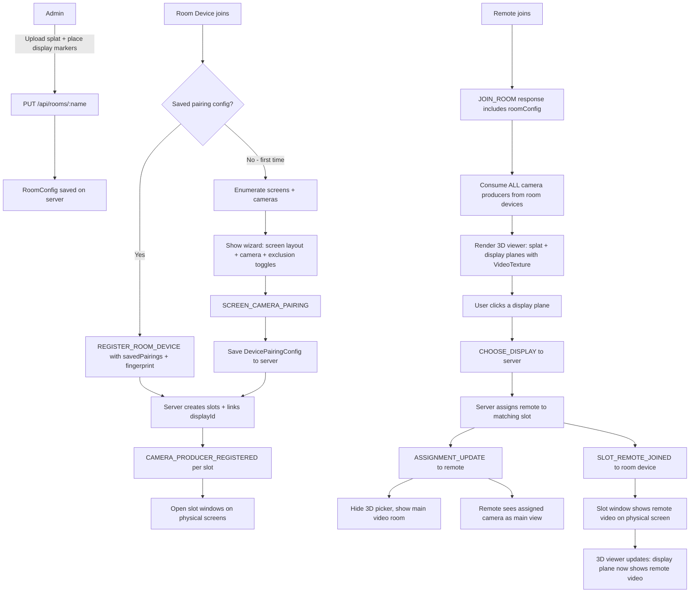

# Hybrid Communication System — Implementation Plan v2

## Executive Summary

The goal is a **room-aware hybrid video conference** where:
1. An **admin** uploads a `.splat` file of the physical room and places 3D display markers once.
2. **Room devices** (PCs in the room) join, identify which physical screens map to which 3D displays, pair cameras to screens, and optionally exclude screens from the conference.
3. **Remote participants** enter the room, see the 3D clone with **live video feeds playing on the display planes**, pick which display they want to appear on, and receive the camera feed that faces that display.
4. All device configurations are **persisted** so the wizard only runs once per device per room.

---

## Current State Audit

### What Already Works (Keep As-Is)

| Layer | File | Status |
|---|---|---|
| Server types | `server-app/src/types.ts` | Complete |
| Client types | `client-app/src/app/utils/hybrid-types.ts` | Complete |
| Socket actions | `server-app/src/config/actions.ts` | Complete |
| Server topology engine | `server-app/src/core/roomManager.ts` | Complete |
| Server peer model | `server-app/src/core/peer.ts` | Complete |
| Server hybrid handlers | `server-app/src/handlers/hybridHandlers.ts` | Complete |
| Server config service | `server-app/src/services/roomConfigService.ts` | Complete |
| Server REST API | `server-app/src/server.ts` | Complete |
| Client room-device service | `client-app/src/app/services/room-device.service.ts` | Complete |
| Client broadcast channel | `client-app/src/app/services/broadcast-channel.service.ts` | Complete |
| Client video-room service | `client-app/src/app/services/video-room.service.ts` | Mostly complete |
| Client pairing wizard | `client-app/src/app/components/room-device-setup/` | Complete |
| Client slot window | `client-app/src/app/components/video-room/video-room.component.ts` | Complete |

### What Is Missing / Broken / Incomplete

| # | Gap | Impact |
|---|---|---|
| 1 | **Admin 3D room editor** — `real-space.component.ts` loads hardcoded splat, no way to place/edit display markers | Admin cannot set up a new room |
| 2 | **Device fingerprinting** — no stable device ID; wizard always runs on every join | Pairing wizard runs every time |
| 3 | **Saved pairing config not loaded on join** — `loadDevicePairingConfig` exists but never called | Devices must re-pair every session |
| 4 | **Remote participant slot-choice** — server auto-assigns round-robin; user cannot pick a display | Core UX requirement missing |
| 5 | **3D room viewer for remotes with live video on display planes** — no component where remote sees the 3D room with actual video feeds playing on the display markers | Core visual requirement missing |
| 6 | **Screen exclusion** — no UI for room devices to mark screens as reserved for local work | Requirement missing |
| 7 | **`DisplayConfig` to `ScreenSlot` linkage** — `displayId` field exists but never set during device registration | 3D positioning broken |
| 8 | **`real-space.component.ts` is hardcoded** — splat path, room name hardcoded; not connected to `RoomConfig` | Cannot support multiple rooms |
| 9 | **Home page** — no room picker; `inTheRoom` checkbox exists but no room selection | UX entry point incomplete |
| 10 | **`CHOOSE_DISPLAY` socket action missing** — no action for remote to request a specific display | Server-side slot-choice not implemented |

---

## Architecture Overview

```
ADMIN (one-time setup per room)
  /admin/rooms/:name/setup
  Upload .splat → 3D viewer → Click to place display markers
  Set label, width, height, rotation → Save to RoomConfig

ROOM DEVICE (on every join)
  /sfu/:roomName?inTheRoom=true
  1. Generate/load deviceFingerprint (localStorage)
  2. Load saved DevicePairingConfig from server (if exists)
     - EXISTS: skip wizard, register with saved pairings
     - NOT EXISTS: enumerate screens/cameras, show wizard
  3. Emit REGISTER_ROOM_DEVICE { capabilities, fingerprint, savedPairings? }
  4. Server creates ScreenSlots, links to DisplayConfig via displayId
  5. Open one browser window per active slot (positioned on physical screen)

REMOTE PARTICIPANT (on join)
  /sfu/:roomName
  1. Join room, server sends RoomTopologyDTO + RoomConfig
  2. Show 3D room viewer:
     - Splat renders the physical room
     - Display markers show as 3D planes
     - Each plane plays the LIVE camera feed from that display's paired camera
     - Planes for displays with an assigned remote show that remote's video
  3. User clicks a display plane to choose it
  4. Emit CHOOSE_DISPLAY { displayId }
  5. Server assigns remote to the slot linked to that displayId
  6. Remote's video appears on the physical screen of that slot
  7. Remote sees the camera feed from that display as their main view
```

---

## The 3D Live Video Display Planes — Core Visual Concept

This is the central UX innovation. When a remote participant opens the 3D room viewer:

- The **splat** renders the physical room in 3D (walls, furniture, etc.)
- Each configured **display** appears as a `THREE.PlaneGeometry` positioned and rotated in 3D space
- Each plane has a **`THREE.VideoTexture`** applied to it, sourced from the **mediasoup consumer** for that display's paired camera
- This means the remote participant literally sees the room in 3D with the screens showing live video
- If a display already has a remote assigned to it, the plane shows **that remote's video** (what the physical screen is actually showing)
- If a display is available (no remote assigned), the plane shows the **camera feed** (what the room looks like from that angle)
- The remote clicks a plane to "sit in front of" that display

### Video Texture Pipeline

```
Room Device
  Camera → MediaStream → mediasoup Producer → Server SFU

Remote Participant (in 3D viewer)
  Server SFU → mediasoup Consumer → MediaStream → HTMLVideoElement (hidden)
             → THREE.VideoTexture → PlaneGeometry material
             → Rendered on display plane in 3D scene
```

The remote participant must **consume all camera producers** (one per display) before the 3D viewer renders, so all planes show live video. This is done via the existing `connectRecvTransport` flow — the remote consumes all producers, then the 3D viewer maps each producer to its display plane via `slot.cameraProducerId → slot.displayId → DisplayConfig.position3D`.

---

## Data Flow Diagram

```
Admin Setup
  POST /api/rooms { roomName }
  POST /api/rooms/:name/splat (file upload)
  PUT  /api/rooms/:name { displays: [DisplayConfig...] }
       DisplayConfig: { displayId, label, position3D, rotationY, widthM, heightM }

Room Device Join
  socket JOIN_ROOM { roomName, userName, isRoomDevice: true, fingerprint }
  socket REGISTER_ROOM_DEVICE { capabilities, fingerprint, savedPairings? }
       Server: createScreenSlots, link displayId from savedPairings
       Server: ROOM_TOPOLOGY_UPDATE to all peers
  socket SCREEN_CAMERA_PAIRING { pairings } (only if no saved config)
  socket CAMERA_PRODUCER_REGISTERED { slotId, producerId }
  PUT /api/rooms/:name/device-config/:fingerprint (save pairings)

Remote Join
  socket JOIN_ROOM { roomName, userName, isRoomDevice: false }
       Server: sends back rtpCapabilities + roomConfig (for 3D viewer)
  Client: consume ALL camera producers (one per slot)
  Client: render 3D viewer with VideoTexture on each display plane
  User clicks a display plane
  socket CHOOSE_DISPLAY { displayId }
       Server: find slot with matching displayId, assign remote
       Server: ASSIGNMENT_UPDATE to remote
       Server: SLOT_REMOTE_JOINED to room device
  Client: navigate from 3D picker to main video room view
```

---

## Implementation Phases

---

### Phase B — Server: `CHOOSE_DISPLAY` action and display-aware assignment

**Files to modify:**
- [`server-app/src/config/actions.ts`](server-app/src/config/actions.ts)
- [`server-app/src/core/roomManager.ts`](server-app/src/core/roomManager.ts)
- [`server-app/src/handlers/hybridHandlers.ts`](server-app/src/handlers/hybridHandlers.ts)
- [`server-app/src/handlers/roomHandlers.ts`](server-app/src/handlers/roomHandlers.ts)

**Changes:**

1. Add to `actions.ts`:
```typescript
CHOOSE_DISPLAY: "chooseDisplay",
EXCLUDE_SCREEN: "excludeScreen",
INCLUDE_SCREEN: "includeScreen",
```

2. Add to `Room` in `roomManager.ts`:
```typescript
assignRemoteToDisplay(remoteSocketId: string, displayId: string): ScreenSlot | null {
  const slot = Array.from(this.topology.slots.values())
    .find(s => s.displayId === displayId && s.cameraDeviceId !== null && !s.excluded);
  if (!slot) return null;
  if (!slot.assignedRemoteIds.includes(remoteSocketId)) {
    slot.assignedRemoteIds.push(remoteSocketId);
  }
  return slot;
}

matchSlotsToDisplays(roomConfig: RoomConfig): void {
  // When savedPairings include displayId, set it directly on the slot
  // When no saved config, this is called after wizard with manual mapping
}
```

3. Handle `CHOOSE_DISPLAY` in `hybridHandlers.ts`:
```typescript
socket.on(ACTIONS.CHOOSE_DISPLAY, ({ displayId }, callback) => {
  const slot = room.assignRemoteToDisplay(socket.id, displayId);
  if (!slot) { callback({ error: 'display-not-available' }); return; }
  const assignment: RemoteAssignment = { slotId, screenLabel, cameraProducerId, deviceSocketId };
  socket.emit(ACTIONS.ASSIGNMENT_UPDATE, assignment);
  namespace.to(slot.deviceSocketId).emit(ACTIONS.SLOT_REMOTE_JOINED, { ... });
  namespace.to(roomName).emit(ACTIONS.ROOM_TOPOLOGY_UPDATE, topologyDTO);
  callback({ success: true, assignment });
});
```

4. Extend `JOIN_ROOM` response in `roomHandlers.ts`:
```typescript
callback({
  rtpCapabilities: room.router.rtpCapabilities,
  assignment: existingAssignment ?? null,
  roomConfig: roomConfigService.loadRoomConfig(roomName) ?? null,  // NEW
});
```

---

### Phase C — Server: Device fingerprinting and saved pairing on join

**Files to modify:**
- [`server-app/src/core/peer.ts`](server-app/src/core/peer.ts)
- [`server-app/src/handlers/hybridHandlers.ts`](server-app/src/handlers/hybridHandlers.ts)

**Changes:**

1. Add `deviceFingerprint?: string` to `Peer` class.

2. Extend `REGISTER_ROOM_DEVICE` handler to accept `fingerprint` and `savedPairings`:
```typescript
socket.on(ACTIONS.REGISTER_ROOM_DEVICE, ({ capabilities, fingerprint, savedPairings }) => {
  peer.deviceFingerprint = fingerprint;
  const newSlots = room.registerDevice(socket.id, capabilities);

  if (savedPairings?.length) {
    // Apply saved pairings directly — skip wizard
    room.applyScreenCameraPairing(savedPairings);
    // Set displayId on each slot from saved pairings
    savedPairings.forEach(p => {
      const slot = Array.from(room.topology.slots.values())
        .find(s => s.deviceSocketId === socket.id && s.screenIndex === p.screenIndex);
      if (slot && p.displayId) slot.displayId = p.displayId;
      if (slot && p.excluded) slot.excluded = true;
    });
    const newAssignments = room.rebalanceAssignments();
    // notify remotes of new assignments
  }

  callback({ success: true, slots: newSlots.map(s => s.slotId), hasSavedConfig: !!savedPairings?.length });
});
```

---

### Phase D — Server: Screen exclusion support

**Files to modify:**
- [`server-app/src/types.ts`](server-app/src/types.ts)
- [`server-app/src/core/roomManager.ts`](server-app/src/core/roomManager.ts)

**Changes:**

Add `excluded: boolean` to `ScreenSlot` and `ScreenSlotDTO`. Update `getPairedSlots()` to filter excluded slots. Handle `EXCLUDE_SCREEN` / `INCLUDE_SCREEN` socket events.

---

### Phase E — Client: Admin 3D Room Editor

**New component:** `client-app/src/app/components/admin/room-editor/`

**Route:** `/admin/rooms/:name/setup`

**Functionality:**
1. Load `RoomConfig` from `GET /api/rooms/:name`
2. Load splat from `GET /api/rooms/:name/splat` and render in GaussianSplats3D viewer
3. Show existing `DisplayConfig` markers as 3D planes (semi-transparent, labelled)
4. **Click-to-place mode**: user clicks in 3D scene → raycaster finds intersection → creates `DisplayConfig` at that position
5. **Edit panel**: for each display, edit label, width, height, rotationY
6. **Delete display**: remove a marker
7. Save via `PUT /api/rooms/:name`

**Raycasting approach:**
```typescript
// Use a large invisible floor/wall plane for intersection
const raycaster = new THREE.Raycaster();
const floorPlane = new THREE.Plane(new THREE.Vector3(0, 1, 0), 0);
// On canvas click:
raycaster.setFromCamera(mouse, camera);
const point = new THREE.Vector3();
raycaster.ray.intersectPlane(floorPlane, point);
// point is the 3D position where the user clicked
```

**Display marker rendering:**
Each `DisplayConfig` renders as a `THREE.PlaneGeometry` (sized `widthM × heightM`) with a semi-transparent blue material, positioned at `position3D`, rotated by `rotationY`. A `THREE.Sprite` label shows the display name.

---

### Phase F — Client: Room Device Join Flow (Revised)

**Files to modify:**
- [`client-app/src/app/services/room-device.service.ts`](client-app/src/app/services/room-device.service.ts)
- [`client-app/src/app/services/video-room.service.ts`](client-app/src/app/services/video-room.service.ts)
- [`client-app/src/app/components/room-device-setup/room-device-setup.component.ts`](client-app/src/app/components/room-device-setup/room-device-setup.component.ts)
- [`client-app/src/app/components/video-room/video-room.component.ts`](client-app/src/app/components/video-room/video-room.component.ts)

**New flow:**

```
1. Generate fingerprint
   key: `hybrid-device-id` in localStorage
   value: crypto.randomUUID() on first run, persisted

2. Fetch saved config: GET /api/rooms/:name/device-config/:fingerprint
   - 200 OK: hasSavedConfig = true, savedPairings = config.pairings
   - 404:    hasSavedConfig = false

3. Enumerate screens and cameras (always needed)

4. Emit REGISTER_ROOM_DEVICE { capabilities, fingerprint, savedPairings? }
   - hasSavedConfig=true: server applies pairings, no wizard
     → start producing cameras immediately
     → open slot windows
   - hasSavedConfig=false: show wizard
     → wizard: screen layout + camera assignment + exclusion toggles
     → on confirm: emit SCREEN_CAMERA_PAIRING
     → save: PUT /api/rooms/:name/device-config/:fingerprint
     → start producing cameras
     → open slot windows
```

**Screen exclusion in wizard:**
Add a toggle per screen: "Exclude from conference (use for local work)". Excluded screens get a slot window showing a "Screen reserved" overlay.

**`generateFingerprint()` in `RoomDeviceService`:**
```typescript
generateFingerprint(roomName: string): string {
  const key = `hybrid-device-id`;
  let id = localStorage.getItem(key);
  if (!id) {
    id = crypto.randomUUID();
    localStorage.setItem(key, id);
  }
  return id;
}
```

---

### Phase G — Client: Remote Participant 3D Display Picker

**New component:** `client-app/src/app/components/display-picker/`

This is the most visually rich component. It is shown as an **overlay** on the video room page after joining, before the main video grid appears.

**Functionality:**

1. Receive `roomConfig` from `JOIN_ROOM` response (contains `displays: DisplayConfig[]`)
2. Receive `topology` (contains which slots have `cameraProducerId` set)
3. **Consume all camera producers** from room devices (one per slot) via the existing mediasoup consumer flow
4. Render the 3D splat viewer (load from `/api/rooms/:name/splat`)
5. For each `DisplayConfig`, create a `THREE.PlaneGeometry` at `position3D` with `rotationY`:
   - Find the matching `ScreenSlotDTO` via `slot.displayId === display.displayId`
   - If slot has `cameraProducerId`: create a hidden `<video>` element, attach the consumer's `MediaStream`, create a `THREE.VideoTexture` from it, apply as the plane's material
   - If slot has no producer yet: show a placeholder texture (grey with label)
   - If slot has `assignedRemoteIds.length > 0`: the plane shows the remote's video (what the physical screen is actually showing)
6. User hovers a plane → highlight it, show tooltip with display label
7. User clicks a plane → emit `CHOOSE_DISPLAY { displayId }`
8. On `ASSIGNMENT_UPDATE` received → hide picker overlay, show main video room

**VideoTexture pipeline:**
```typescript
// For each display plane:
const videoEl = document.createElement('video');
videoEl.srcObject = consumerStream; // MediaStream from mediasoup consumer
videoEl.autoplay = true;
videoEl.muted = true;
videoEl.play();

const texture = new THREE.VideoTexture(videoEl);
texture.minFilter = THREE.LinearFilter;
texture.magFilter = THREE.LinearFilter;

const material = new THREE.MeshBasicMaterial({ map: texture, side: THREE.DoubleSide });
const geometry = new THREE.PlaneGeometry(display.widthM, display.heightM);
const plane = new THREE.Mesh(geometry, material);
plane.position.set(display.position3D.x, display.position3D.y, display.position3D.z);
plane.rotation.y = display.rotationY;
scene.add(plane);
```

**Mapping consumers to displays:**
The remote participant consumes producers. Each producer has a `slotId` in its `appData` (set when room device calls `producerTransport.produce({ appData: { slotId } })`). The slot has a `displayId`. So:
```
producerId → slot.cameraProducerId match → slot.displayId → DisplayConfig.position3D → PlaneGeometry
```

This mapping is done client-side using the `RoomTopologyDTO` received via `ROOM_TOPOLOGY_UPDATE`.

**Fallback (if 3D viewer fails):**
Show a simple list of display labels with "Choose" buttons. Each button emits `CHOOSE_DISPLAY`.

---

### Phase H — Client: Slot-View Window Improvements

**Files to modify:**
- [`client-app/src/app/components/video-room/video-room.component.ts`](client-app/src/app/components/video-room/video-room.component.ts)

**Changes:**

1. **Excluded screen handling**: if `slot.excluded`, show "Screen reserved for local work" overlay
2. **Display label**: show admin-defined label from `RoomConfig.displays` (not just OS screen label)
3. **Reconnection**: detect if main window reloads and re-sync slot state

---

### Phase I — Integration Wiring

**Files to modify:**
- [`client-app/src/app/app.routes.ts`](client-app/src/app/app.routes.ts)
- [`client-app/src/app/components/home/home.component.ts`](client-app/src/app/components/home/home.component.ts)
- [`client-app/src/app/components/home/home.component.html`](client-app/src/app/components/home/home.component.html)

**New routes:**
```typescript
{ path: 'admin/rooms/:name/setup', component: RoomEditorComponent },
```

**Home page changes:**
- Room name input (existing)
- "I am in the room" toggle → room device flow
- "Join as remote" → navigate to `/sfu/:roomName`
- Admin section: list rooms, link to room editor

---

### Phase J — Persistence and Config Management

**Already implemented (keep):**
- `roomConfigService.ts` — full CRUD
- REST endpoints in `server.ts`

**Missing:**
1. **Admin UI for room list** — simple page at `/admin` listing rooms with links to editor
2. **Device config auto-save** — after wizard, client calls `PUT /api/rooms/:name/device-config/:fingerprint`
3. **Splat serving** — verify `GET /api/rooms/:name/splat` works correctly in Docker

---

## Revised Data Model Changes

### `ScreenSlot` additions
```typescript
export interface ScreenSlot {
  // ... existing fields ...
  excluded: boolean;        // screen reserved for local work
  displayLabel?: string;    // admin-defined label from DisplayConfig
}
```

### `DevicePairingConfig.pairings` additions
```typescript
pairings: {
  displayId: string;
  screenIndex: number;
  cameraDeviceId: string;
  cameraLabel: string;
  excluded: boolean;        // was this screen excluded?
}[];
```

### `REGISTER_ROOM_DEVICE` payload extension
```typescript
{
  capabilities: RoomDeviceCapabilities;
  fingerprint: string;
  savedPairings?: DevicePairingConfig['pairings'];
}
```

### `JOIN_ROOM` response extension
```typescript
{
  rtpCapabilities: RtpCapabilities;
  assignment?: RemoteAssignment;
  roomConfig?: RoomConfig;    // for 3D display picker
}
```

### New socket actions
```typescript
CHOOSE_DISPLAY: "chooseDisplay",
EXCLUDE_SCREEN: "excludeScreen",
INCLUDE_SCREEN: "includeScreen",
```

---

## File-by-File Change Summary

### Server-side

| File | Change | Description |
|---|---|---|
| `server-app/src/config/actions.ts` | Modify | Add `CHOOSE_DISPLAY`, `EXCLUDE_SCREEN`, `INCLUDE_SCREEN` |
| `server-app/src/types.ts` | Modify | Add `excluded` to `ScreenSlot` and `ScreenSlotDTO` |
| `server-app/src/core/peer.ts` | Modify | Add `deviceFingerprint?: string` |
| `server-app/src/core/roomManager.ts` | Modify | Add `assignRemoteToDisplay()`, `matchSlotsToDisplays()`, `excludeSlot()`, update `getPairedSlots()` |
| `server-app/src/handlers/hybridHandlers.ts` | Modify | Handle `CHOOSE_DISPLAY`, `EXCLUDE_SCREEN`; extend `REGISTER_ROOM_DEVICE` |
| `server-app/src/handlers/roomHandlers.ts` | Modify | Include `roomConfig` in `JOIN_ROOM` response |

### Client-side

| File | Change | Description |
|---|---|---|
| `client-app/src/app/utils/hybrid-types.ts` | Modify | Add `excluded` to `ScreenSlotDTO`; add `CHOOSE_DISPLAY` payload types |
| `client-app/src/app/services/room-device.service.ts` | Modify | Add `generateFingerprint()`, `loadSavedConfig()`, `savePairingConfig()` |
| `client-app/src/app/services/video-room.service.ts` | Modify | Pass fingerprint in `REGISTER_ROOM_DEVICE`; emit `CHOOSE_DISPLAY` |
| `client-app/src/app/components/room-device-setup/room-device-setup.component.ts` | Modify | Add screen exclusion toggle |
| `client-app/src/app/components/video-room/video-room.component.ts` | Modify | Handle excluded slots; show display picker for remotes |
| `client-app/src/app/components/real-space/real-space.component.ts` | Replace | Rewrite as admin 3D room editor with click-to-place display markers |
| `client-app/src/app/components/admin/admin.component.ts` | Modify | Add room list management UI |
| `client-app/src/app/app.routes.ts` | Modify | Add `/admin/rooms/:name/setup` route |
| `client-app/src/app/components/home/home.component.ts` | Modify | Add room picker, cleaner join flow |
| NEW: `client-app/src/app/components/display-picker/` | Create | 3D display picker with live VideoTexture on display planes |

---

## Key Design Decisions

### 1. Device Fingerprinting
Use `crypto.randomUUID()` stored in `localStorage` under key `hybrid-device-id`. Stable across browser sessions. Passed to server on every `REGISTER_ROOM_DEVICE`.

### 2. Display to Slot Matching
When a room device registers with `savedPairings`, each pairing includes a `displayId`. The server directly sets `slot.displayId = pairing.displayId`. On first run (no saved config), the wizard shows the list of configured displays alongside the screen layout, and the operator manually maps each screen to a display. This mapping is then saved.

### 3. Live Video on Display Planes
Remote participants consume all camera producers before the 3D viewer renders. Each consumer's `MediaStream` is attached to a hidden `<video>` element, which feeds a `THREE.VideoTexture` applied to the corresponding display plane. The mapping is: `producerId → slot.cameraProducerId → slot.displayId → DisplayConfig.position3D`.

### 4. What the Display Planes Show
- **Camera feed** (default): the live camera feed from the camera paired to that display — shows what the room looks like from that angle
- **Remote's video** (when assigned): if a remote participant is assigned to that slot, the physical screen is showing their video — so the plane should show the remote's video stream instead, to accurately represent what's on the physical screen

This means the display picker component needs to know both the camera producer AND the assigned remote's producer for each slot, and switch between them.

### 5. Screen Exclusion
Excluded screens still get a `ScreenSlot` on the server but `excluded: true` means they are invisible to remotes and not in the assignment pool. The slot window for an excluded screen shows a "Reserved" overlay.

### 6. Remote Display Picker as Overlay
The display picker is shown as an overlay on the video room page (not a separate route). It appears after `JOIN_ROOM` succeeds and disappears once `CHOOSE_DISPLAY` is acknowledged. This keeps the mediasoup connection alive.

---

## Full System Flow Diagram



---

## Implementation Order

1. **Phase B** — Add `CHOOSE_DISPLAY` server action + `assignRemoteToDisplay()` (unblocks remote UX)
2. **Phase C** — Fingerprinting + saved pairing on join (unblocks device re-join)
3. **Phase D** — Screen exclusion flag (small server change)
4. **Phase F** — Client device join flow with fingerprint + saved config + exclusion UI
5. **Phase G** — Display picker component with live VideoTexture on display planes (core visual feature)
6. **Phase E** — Admin 3D room editor (can be done last; rooms can be configured via API in the meantime)
7. **Phase H** — Slot window improvements
8. **Phase I** — Route + home page wiring
9. **Phase J** — Admin room list UI + splat serving verification
