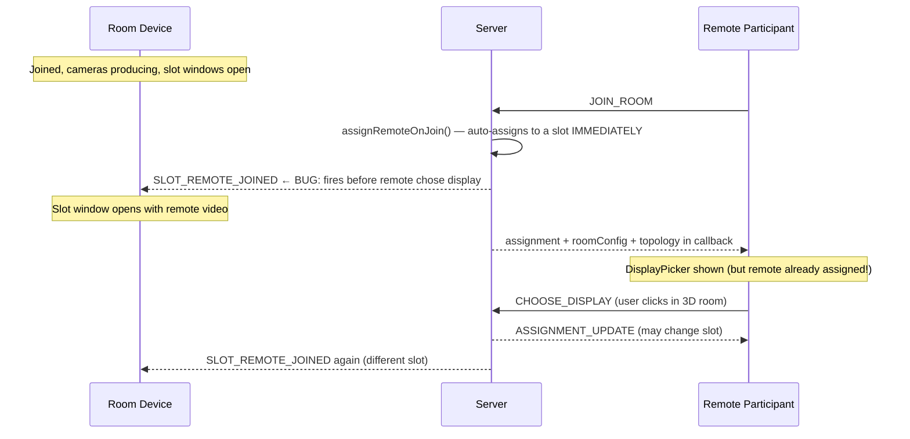
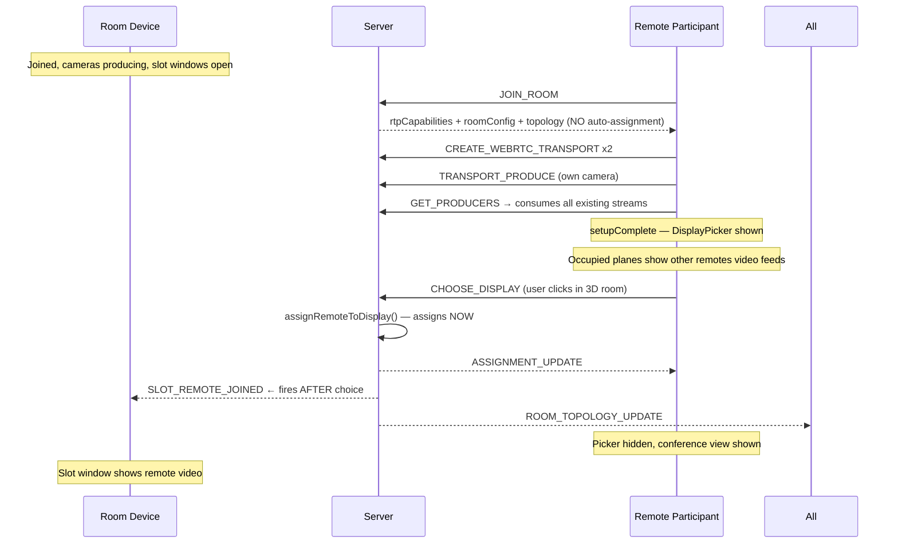
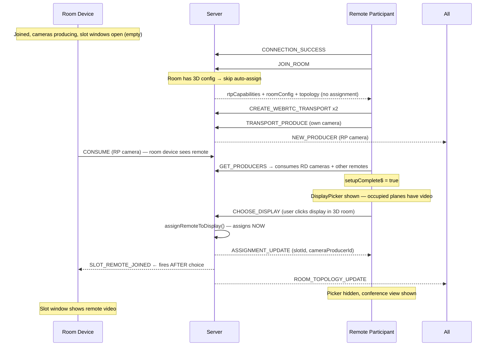

# Hybrid Video Conference — Root Cause Analysis & Fix Plan

## Executive Summary

The system has a fundamentally broken **connection sequencing** problem. The server auto-assigns remote participants to slots the moment they join (`assignRemoteOnJoin`), which fires `SLOT_REMOTE_JOINED` to the room device and causes slot windows to open with the remote's video — **before the remote has chosen a display**. The DisplayPicker is supposed to be the mechanism for choosing, but the server bypasses it entirely.

Additionally, the DisplayPicker itself has a stream-lookup bug: occupied planes show a green border but no video because streams are looked up before consumers are established.

---

## The Core Sequencing Problem

### What happens today (broken)



**Result:** Remote appears on a random screen before choosing. The DisplayPicker is cosmetic — the assignment already happened.

### What should happen (correct)



---

## Root Cause Analysis

### Bug 1 — Server: `assignRemoteOnJoin()` fires before display choice

**Location:** [`roomHandlers.ts:39`](server-app/src/handlers/roomHandlers.ts:39) + [`hybridHandlers.ts:451`](server-app/src/handlers/hybridHandlers.ts:451)

```typescript
// roomHandlers.ts — JOIN_ROOM handler
if (!isRoomDevice) {
    assignment = assignRemoteOnJoin(socket.id, userName, namespace, roomManager);
    // ↑ This immediately assigns the remote to a slot AND fires SLOT_REMOTE_JOINED to the room device
}
```

**Fix:** When the room has a 3D config (DisplayPicker mode), skip `assignRemoteOnJoin()`. The remote will call `CHOOSE_DISPLAY` explicitly. Only auto-assign in rooms WITHOUT a 3D config (no DisplayPicker).

The server already knows if a room has a config via `roomConfigService.loadRoomConfig(roomName)`. Use this to gate the auto-assignment.

---

### Bug 2 — DisplayPicker: Occupied planes show green border but no video

**Location:** [`display-picker.component.ts:444`](client-app/src/app/components/display-picker/display-picker.component.ts:444)

The `attachCameraStreamToPlane()` method looks up participants by `slot.assignedRemoteIds` (socketIds of remotes assigned to that slot). This is correct — occupied planes should show the assigned remote's video. But the lookup fails because:

1. `getProducers()` is NOT called for remote participants in the `CONNECTION_SUCCESS` handler — it only fires if `producersExist: true` comes back from `TRANSPORT_PRODUCE`
2. Even when called, `updateDisplayPlanes()` **destroys and recreates all planes** on every topology update, losing any attached streams
3. `buildDisplayMaterial()` always returns a blue color for `has_remote` — never uses the video texture

---

### Bug 3 — `updateDisplayPlanes()` destroys state on every topology update

**Location:** [`display-picker.component.ts:251`](client-app/src/app/components/display-picker/display-picker.component.ts:251)

Every topology or roomConfig update clears all planes and recreates them from scratch. Any attached video streams are lost. The `retryAttachStreams()` retry mechanism is a band-aid that doesn't work because the video element's `srcObject` is always null after recreation.

---

### Bug 4 — `getProducers()` not guaranteed to run for remote participants

**Location:** [`video-room.service.ts:470-484`](client-app/src/app/services/video-room.service.ts:470)

```typescript
// In PRODUCE event handler:
if (producersExist) this.getProducers();
```

`getProducers()` is only called if `producersExist` is true when the remote produces their own video. If the room device hasn't produced yet (or produced before the remote joined), `producersExist` may be false and `getProducers()` is never called. The DisplayPicker then has no consumed streams to show.

---

### Bug 5 — DisplayPicker shown before mediasoup setup completes

**Location:** [`video-room.component.ts:113-115`](client-app/src/app/components/video-room/video-room.component.ts:113)

```typescript
if (!this.isRoomDevice) {
    this.loadRoomConfig(); // HTTP call — races with socket setup
}
```

`loadRoomConfig()` is an HTTP call that may resolve before or after the socket `CONNECTION_SUCCESS` handler completes. If it resolves first, the DisplayPicker renders before any consumers exist, so no streams are available to show on planes.

---

### Bug 6 — `assignRemoteToDisplay()` requires `cameraDeviceId !== null`

**Location:** [`roomManager.ts:196-199`](server-app/src/core/roomManager.ts:196)

```typescript
const slot = Array.from(this.topology.slots.values()).find(
    (s) => s.displayId === displayId && s.cameraDeviceId !== null && !s.excluded
);
```

If the room device's camera isn't paired yet, `cameraDeviceId` is null and `CHOOSE_DISPLAY` returns `display-not-available` even though the display exists. This silently fails.

---

## Fix Plan

### Fix 1 (Server): Gate `assignRemoteOnJoin()` on whether room has a 3D config

**File:** [`server-app/src/handlers/roomHandlers.ts`](server-app/src/handlers/roomHandlers.ts)

```typescript
// In JOIN_ROOM handler:
const roomConfig = roomConfigService.loadRoomConfig(roomName);

let assignment = null;
if (!isRoomDevice) {
    // Only auto-assign if room has NO 3D display config.
    // Rooms with a config use the DisplayPicker — remote must call CHOOSE_DISPLAY explicitly.
    const hasDisplayConfig = roomConfig?.displays && roomConfig.displays.length > 0;
    if (!hasDisplayConfig) {
        assignment = assignRemoteOnJoin(socket.id, userName, namespace, roomManager);
    }
}
```

This is the **most important fix**. It ensures the DisplayPicker is the authoritative assignment mechanism when a 3D room is configured.

---

### Fix 2 (Client): `VideoRoomService` — always call `getProducers()` after `produceVideo()`

**File:** [`client-app/src/app/services/video-room.service.ts`](client-app/src/app/services/video-room.service.ts)

In the `CONNECTION_SUCCESS` handler:

```typescript
if (this.isRoomDevice) {
    await this.registerAsRoomDevice();
} else {
    await this.produceVideo();
    await this.getProducers(); // ← ADD: always consume existing producers
    this.setupComplete$.next(true); // ← ADD: signal setup is done
}
```

Add a `setupComplete$` BehaviorSubject that fires `true` after setup completes. This lets the DisplayPicker wait for consumers before rendering.

---

### Fix 3 (Client): `VideoRoomComponent` — show DisplayPicker only after setup is complete

**File:** [`client-app/src/app/components/video-room/video-room.component.ts`](client-app/src/app/components/video-room/video-room.component.ts)

Replace the racing `loadRoomConfig()` HTTP call with a reactive subscription:

```typescript
// In ngOnInit(), after initializeSocket():
this.subs.push(
    combineLatest([
        this.videoService.setupReady.pipe(filter(r => r)),
        this.videoService.roomConfig.pipe(filter(c => !!c)),
    ]).pipe(take(1)).subscribe(([_, config]) => {
        if (config!.displays?.length > 0) {
            this.showDisplayPicker = true;
            this.cdr.detectChanges();
        }
    })
);
```

Remove `loadRoomConfig()` entirely — the config already arrives in the `JOIN_ROOM` callback and is seeded into `roomConfig$`.

---

### Fix 4 (Client): `DisplayPickerComponent` — split create vs update, fix stream lookup

**File:** [`client-app/src/app/components/display-picker/display-picker.component.ts`](client-app/src/app/components/display-picker/display-picker.component.ts)

**4a. Single `combineLatest` subscription** replacing the three separate subscriptions + `retryAttachStreams()`:

```typescript
combineLatest([
    this.videoService.roomConfig.pipe(filter(c => !!c)),
    this.videoService.topology.pipe(filter(t => !!t)),
    this.videoService.getParticipants(),
]).subscribe(([config, topology, participants]) => {
    if (!this.viewer) return;
    if (!this.planesCreated) {
        this.createDisplayPlanes(config!, topology!, participants);
        this.planesCreated = true;
    } else {
        this.updatePlaneStates(topology!, participants);
    }
});
```

**4b. `createDisplayPlanes()`** — called once. Creates geometry, video elements, initial materials.

**4c. `updatePlaneStates()`** — called on topology/participant updates. Only updates material and border color. Does NOT recreate planes or video elements.

**4d. Fix `buildDisplayMaterial()` for `has_remote`** — use video texture directly:

```typescript
case 'has_remote':
    return new THREE.MeshBasicMaterial({
        map: videoTexture,
        side: THREE.DoubleSide,
    });
```

**4e. Remove** `retryAttachStreams()`, the separate topology/assignment/participant subscriptions, and the `updateDisplayPlanes()` method.

---

### Fix 5 (Server): Remove `cameraDeviceId !== null` guard from `assignRemoteToDisplay()`

**File:** [`server-app/src/core/roomManager.ts`](server-app/src/core/roomManager.ts)

```typescript
assignRemoteToDisplay(remoteSocketId: string, displayId: string): ScreenSlot | null {
    const slot = Array.from(this.topology.slots.values()).find(
        (s) => s.displayId === displayId && !s.excluded
        // Removed: && s.cameraDeviceId !== null
    );
    ...
}
```

The remote receives `cameraProducerId: null` initially, then gets an `ASSIGNMENT_UPDATE` when `CAMERA_PRODUCER_REGISTERED` fires — this already works correctly in [`hybridHandlers.ts:204-213`](server-app/src/handlers/hybridHandlers.ts:204).

---

### Fix 6 (Client): `VideoRoomComponent` — fix slot window subscription timing

**File:** [`client-app/src/app/components/video-room/video-room.component.ts`](client-app/src/app/components/video-room/video-room.component.ts)

Move the `combineLatest([slots, participants])` subscription to `ngOnInit()` (always active), not inside `openSlotWindows()`. Gate on `slotWindows.size > 0`. Remove `tryAttachOrphanedParticipants()` and the `setTimeout` hack.

---

### Fix 7 (Cleanup): Remove dead `RoomDeviceViewComponent`

**File:** [`client-app/src/app/components/room-device-view/room-device-view.component.ts`](client-app/src/app/components/room-device-view/room-device-view.component.ts)

This Angular component is never rendered — slot windows are plain HTML managed imperatively in `video-room.component.ts`. Delete the component and its route to reduce confusion.

---

## Summary of Files to Change

| File | Change |
|------|--------|
| [`roomHandlers.ts`](server-app/src/handlers/roomHandlers.ts) | **[Critical]** Skip `assignRemoteOnJoin()` when room has 3D config |
| [`video-room.service.ts`](client-app/src/app/services/video-room.service.ts) | Add `setupComplete$`; always call `getProducers()` after `produceVideo()` |
| [`video-room.component.ts`](client-app/src/app/components/video-room/video-room.component.ts) | Use `setupReady + roomConfig` to show DisplayPicker; fix slot subscription timing; remove `loadRoomConfig()` |
| [`display-picker.component.ts`](client-app/src/app/components/display-picker/display-picker.component.ts) | Single `combineLatest`; split create/update; fix `has_remote` material; remove retries |
| [`roomManager.ts`](server-app/src/core/roomManager.ts) | Remove `cameraDeviceId !== null` guard from `assignRemoteToDisplay()` |
| [`room-device-view.component.ts`](client-app/src/app/components/room-device-view/room-device-view.component.ts) | Delete (dead code) |

---

## Correct Connection Sequence After All Fixes



---

## What NOT to change

- The server-side topology/assignment engine (`rebalanceAssignments`, `unassignRemote`, etc.) is correct
- The `BroadcastChannelService` approach is correct (MediaStream can't cross BroadcastChannel)
- The `window.opener.__participantStreamsBySocketId__` pattern for slot windows is correct
- The `THREE.VideoTexture` approach for displaying video in 3D is correct
- The mediasoup transport/consumer/producer setup is correct
- The `CAMERA_PRODUCER_REGISTERED` → `ASSIGNMENT_UPDATE` re-notification flow is correct
- The `CHOOSE_DISPLAY` handler in `hybridHandlers.ts` is correct (just needs the `cameraDeviceId` guard removed)
